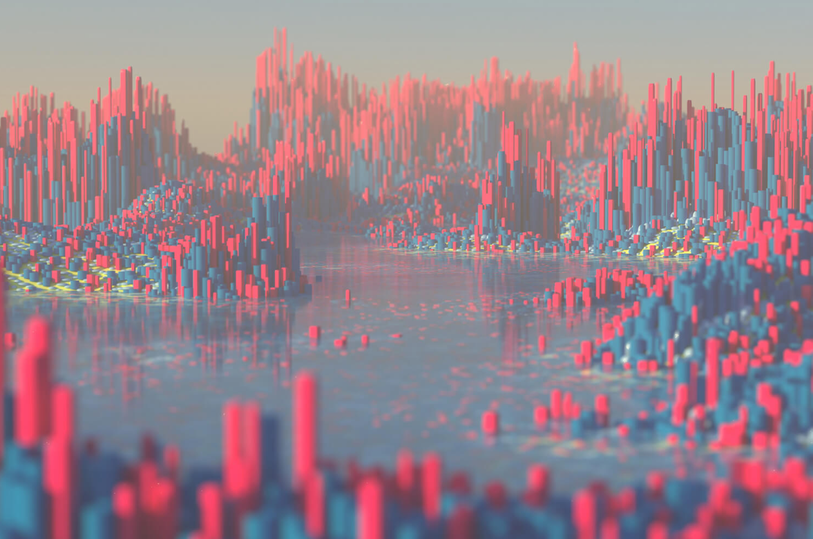
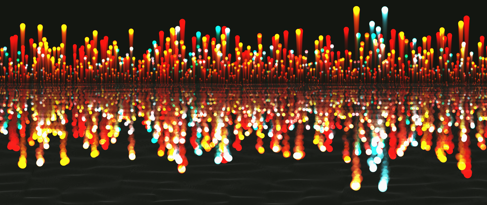
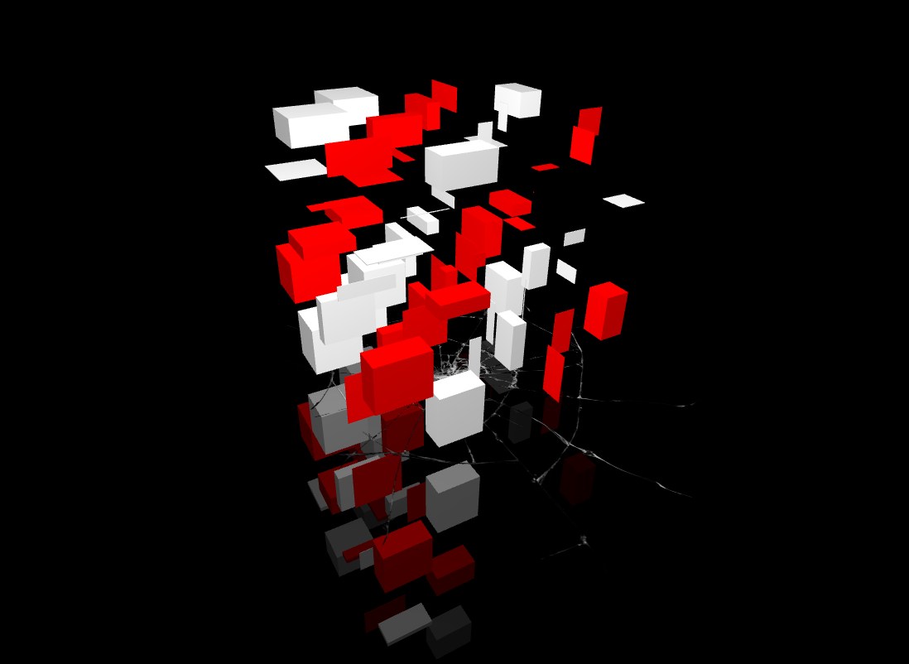

# ylin0904_9103_tut2_Quiz 8
## Inspiration 1:
It looks complicated and it is indeed complicated, but it is so fascinating at the same time. First, they blur the front and the back to make you focus on the middle. And the whole background is a combination of simple shapes.

## Inspiration 2:
This one has a simple background, but the reflection makes it so unique and beautiful. It made me want to combine the first one and this one together.

## Technique:
This one has an amazing 3D effect and reflection at the same time. Not only that but the shape also has a real-time change. The whole object also keeps spinning. And we can rotate the screen or drag it to see the object from every angles.

[Link to the actual code](https://openprocessing.org/sketch/1582090)
